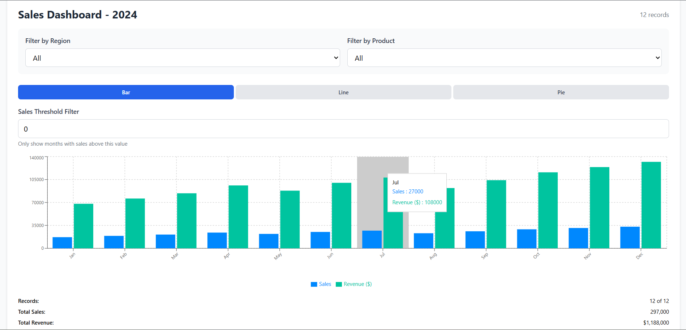
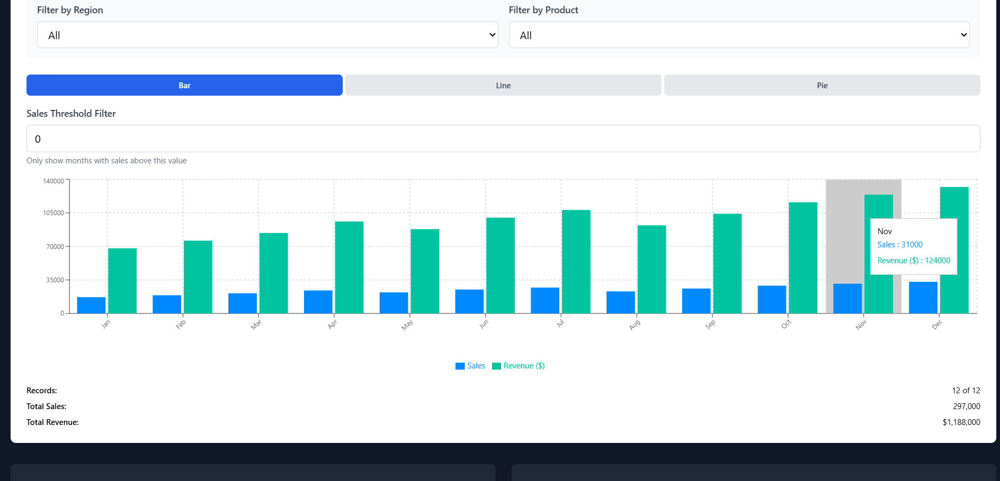
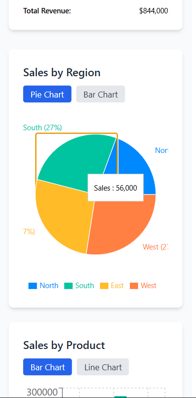
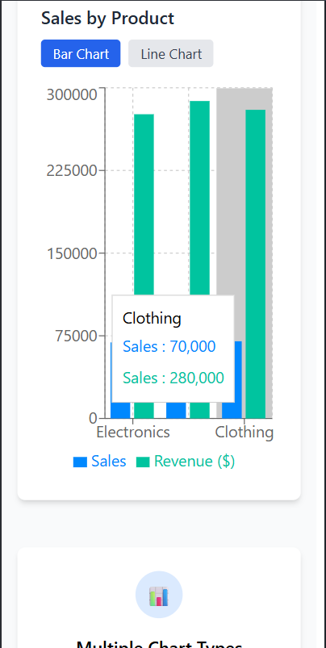
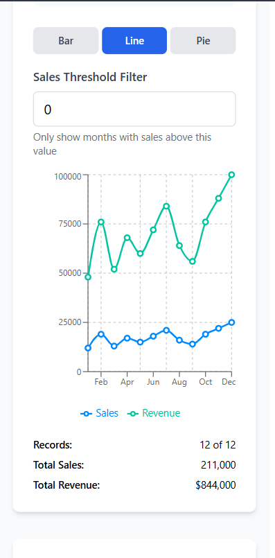
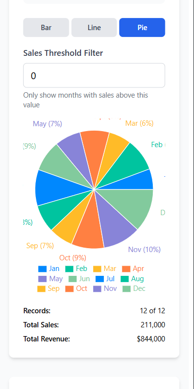
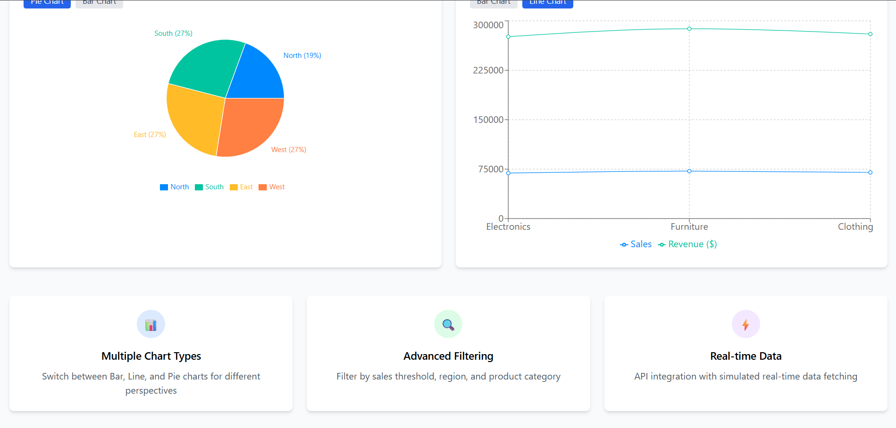
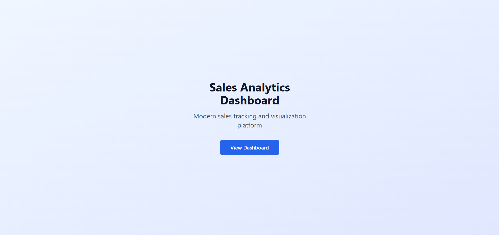
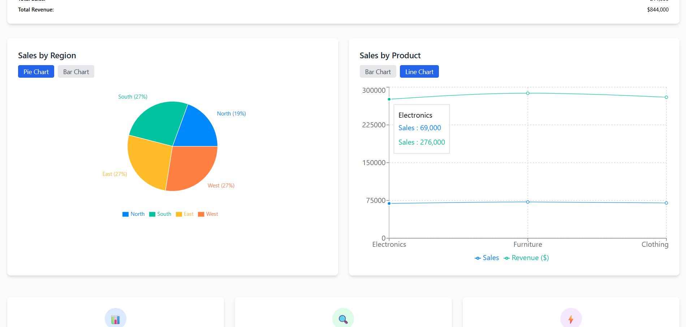

<div align="center">

# 📊 Sales Analytics Dashboard

### Transform your sales data into actionable insights with interactive visualizations

[](https://nextjs.org/)
[](https://www.typescriptlang.org/)
[](https://tailwindcss.com/)
[](https://recharts.org/)
[](LICENSE)

[🚀 Live Demo](https://sales-dashboard-two-sigma.vercel.app) • [📖 Documentation](#-features) • [🐛 Report Bug](https://github.com/prem-patel22/sales-dashboard/issues) • [✨ Request Feature](https://github.com/prem-patel22/sales-dashboard/issues)

---

### A modern, full-featured sales analytics platform featuring real-time data visualization, advanced filtering, and comprehensive reporting capabilities.

</div>

---

## 📸 Screenshots & Preview

<div align="center">

### 🖥️ Desktop View - Light Mode
*Full dashboard experience with interactive charts and analytics overview*



---

### 🌙 Desktop View - Dark Mode
*Elegant dark theme for reduced eye strain during extended analysis sessions*



---

### 📱 Mobile Responsive Design
*Fully optimized mobile experience with touch-friendly controls*



---

### 📊 Interactive Chart Variations

<table>
  <tr>
    <td width="50%">
      
      <p align="center"><b>📊 Bar Chart View</b><br/>Compare sales performance across periods</p>
    </td>
    <td width="50%">
      
      <p align="center"><b>📈 Line Chart View</b><br/>Track trends and patterns over time</p>
    </td>
  </tr>
  <tr>
    <td width="50%">
      
      <p align="center"><b>🥧 Pie Chart View</b><br/>Visualize distribution and proportions</p>
    </td>
    <td width="50%">
      
      <p align="center"><b>🔍 Advanced Filtering</b><br/>Drill down into specific data segments</p>
    </td>
  </tr>
</table>

---

### 🎯 Additional Features

<table>
  <tr>
    <td width="33%">
      
      <p align="center"><b>📊 Analytics Cards</b></p>
    </td>
    <td width="33%">
      
      <p align="center"><b>💾 Data Export</b></p>
    </td>
    <td width="33%">
      
      <p align="center"><b>🌍 Regional Insights</b></p>
    </td>
  </tr>
</table>

</div>

---

## ✨ Features

<table>
<tr>
<td width="50%" valign="top">

### 📊 Data Visualization
- **Multiple Chart Types** - Bar, Line, and Pie charts with smooth transitions
- **Interactive Elements** - Hover tooltips, clickable legends, zoom controls
- **Real-time Updates** - Live data simulation with WebSocket integration
- **Responsive Charts** - Adaptive sizing for all screen resolutions
- **Animation Effects** - Smooth transitions and loading animations

### 🎯 Advanced Analytics
- **Multi-Year Analysis** - Compare data across 2022, 2023, and 2024
- **Regional Breakdown** - Geographic performance insights (North, South, East, West)
- **Product Tracking** - Individual product performance metrics
- **Sales Thresholds** - Custom filters for targeted analysis
- **Trend Analysis** - Identify patterns and growth opportunities

### 🔍 Filtering & Search
- **Dynamic Filters** - Real-time data filtering without page reload
- **Multi-Criteria Search** - Combine multiple filters simultaneously
- **Debounced Input** - Optimized search performance
- **Filter Persistence** - Save filter preferences
- **Quick Reset** - One-click filter clearing

</td>
<td width="50%" valign="top">

### 🎨 User Experience
- **Dark Mode** - Complete theme system with smooth transitions
- **Theme Persistence** - Remember user preferences
- **Responsive Design** - Desktop, tablet, and mobile optimized
- **Intuitive Navigation** - Clean, modern interface
- **Loading States** - Skeleton loaders and progress indicators
- **Error Handling** - Graceful error messages and recovery

### ⚡ Performance & Technical
- **TypeScript** - 100% type-safe codebase
- **Server Components** - Optimized Next.js 15 App Router
- **Code Splitting** - Lazy loading for faster initial load
- **Optimized Bundle** - Tree-shaking and minification
- **SEO Optimized** - Meta tags and semantic HTML
- **Accessibility** - WCAG 2.1 AA compliant

### 💾 Data Management
- **Export Options** - Download as CSV or JSON
- **API Integration** - RESTful JSON Server backend
- **Data Caching** - Optimized data fetching
- **Offline Support** - Service worker implementation
- **Data Validation** - Input sanitization and validation

</td>
</tr>
</table>

---

## 🛠️ Technology Stack

<div align="center">

| Layer | Technologies | Purpose |
|-------|-------------|---------|
| **Frontend Framework** |   | Server-side rendering, routing, and optimization |
| **Language** |  | Type safety and developer experience |
| **Styling** |   | Utility-first styling and component styles |
| **Data Visualization** |  | Interactive chart components |
| **State Management** |  | Global state and theme management |
| **API & Backend** |  | Mock REST API for development |
| **Deployment** |  | Hosting and continuous deployment |
| **Development Tools** |   | Code quality and consistency |

</div>

### Key Dependencies

```json
{
  "next": "15.0.0",
  "react": "^18.0.0",
  "typescript": "^5.0.0",
  "recharts": "^2.10.0",
  "tailwindcss": "^3.4.0"
}
```

---

## 🚀 Getting Started

### Prerequisites

Ensure you have the following installed on your system:

```bash
Node.js >= 18.17.0
npm >= 9.0.0 or yarn >= 1.22.0
Git >= 2.0.0
```

Check your versions:
```bash
node --version
npm --version
git --version
```

### Quick Installation

#### Option 1: Clone and Install

```bash
# 1. Clone the repository
git clone https://github.com/prem-patel22/sales-dashboard.git

# 2. Navigate to project directory
cd sales-dashboard

# 3. Install dependencies
npm install
# or using yarn
yarn install

# 4. Run development server
npm run dev
# or using yarn
yarn dev

# 5. Open your browser
# Navigate to http://localhost:3000
```

#### Option 2: Using npx (Quick Start)

```bash
npx create-next-app@latest sales-dashboard --example https://github.com/prem-patel22/sales-dashboard
cd sales-dashboard
npm run dev
```

### Environment Setup (Optional)

Create a `.env.local` file for custom configuration:

```env
# API Configuration
NEXT_PUBLIC_API_URL=http://localhost:3001
NEXT_PUBLIC_WS_URL=ws://localhost:3001

# Feature Flags
NEXT_PUBLIC_ENABLE_REALTIME=true
NEXT_PUBLIC_ENABLE_EXPORT=true

# Analytics (Optional)
NEXT_PUBLIC_GA_ID=your-ga-id
```

### Running with JSON Server

For full API functionality with mock data:

```bash
# Install JSON Server globally
npm install -g json-server

# Create db.json file (or use existing)
# Run JSON Server on port 3001
json-server --watch db.json --port 3001

# In a separate terminal, run Next.js
npm run dev
```

### Build for Production

```bash
# Create optimized production build
npm run build

# Start production server
npm start

# Or export as static site
npm run build && npm run export
```

---

## 📖 Usage Guide

### Basic Navigation

1. **Homepage** → Click "View Dashboard" to access the main analytics interface
2. **Year Selection** → Choose between 2022, 2023, or 2024 data using the year selector
3. **Chart Types** → Toggle between Bar, Line, and Pie charts using the chart switcher
4. **Filters** → Apply advanced filters using the filter panel
5. **Theme** → Switch between light and dark mode with the theme toggle
6. **Export** → Download your filtered data as CSV or JSON

### Advanced Features

#### 🔍 Filtering Data

```
1. Click on "Advanced Filters" button
2. Set sales threshold (e.g., sales > $10,000)
3. Select specific regions (North, South, East, West)
4. Choose product categories
5. Apply filters to see updated visualizations
6. Reset filters anytime with "Clear All" button
```

#### 📊 Chart Interactions

| Action | Result |
|--------|--------|
| **Hover over data points** | View detailed tooltips with exact values |
| **Click legend items** | Toggle visibility of data series |
| **Switch chart types** | View data in different visualization formats |
| **Zoom (line charts)** | Click and drag to zoom into specific ranges |

#### 💾 Exporting Data

```
1. Apply desired filters to your data
2. Click "Export Data" button
3. Choose format (CSV or JSON)
4. File downloads automatically
5. Filename includes timestamp and filters applied
```

#### 🌙 Dark Mode

Toggle dark mode for comfortable viewing:
- **Manual Toggle**: Click the sun/moon icon in the header
- **Auto-Persistence**: Your preference is saved automatically
- **System Sync**: Follows system preferences by default

### Keyboard Shortcuts

| Shortcut | Action |
|----------|--------|
| `Ctrl/Cmd + K` | Open quick search |
| `Ctrl/Cmd + D` | Toggle dark mode |
| `Ctrl/Cmd + E` | Export current view |
| `Ctrl/Cmd + R` | Reset all filters |
| `Esc` | Close modals/panels |

---

## 📁 Project Structure

```
sales-dashboard/
│
├── 📁 src/
│   ├── 📁 app/                          # Next.js 15 App Directory
│   │   ├── 📁 dashboard/
│   │   │   ├── page.tsx                 # Main dashboard page
│   │   │   ├── layout.tsx               # Dashboard layout
│   │   │   └── loading.tsx              # Loading state
│   │   ├── layout.tsx                   # Root layout with providers
│   │   ├── page.tsx                     # Landing page
│   │   ├── globals.css                  # Global styles
│   │   ├── error.tsx                    # Error boundary
│   │   └── not-found.tsx                # 404 page
│   │
│   ├── 📁 components/
│   │   ├── 📁 charts/                   # Chart Components
│   │   │   ├── SalesChart.tsx           # Main sales visualization
│   │   │   ├── RegionalChart.tsx        # Regional breakdown
│   │   │   ├── ProductChart.tsx         # Product performance
│   │   │   ├── ChartSwitcher.tsx        # Chart type toggle
│   │   │   ├── FilterInput.tsx          # Filter input component
│   │   │   ├── AdvancedFilters.tsx      # Advanced filtering UI
│   │   │   ├── AnalyticsOverview.tsx    # Summary statistics
│   │   │   └── ExportData.tsx           # Data export functionality
│   │   │
│   │   ├── 📁 ui/                       # UI Components
│   │   │   ├── Card.tsx                 # Reusable card component
│   │   │   ├── Button.tsx               # Button component
│   │   │   ├── LoadingSpinner.tsx       # Loading indicators
│   │   │   ├── ThemeToggle.tsx          # Dark mode switch
│   │   │   ├── RealTimeIndicator.tsx    # Live data indicator
│   │   │   ├── Modal.tsx                # Modal dialog
│   │   │   └── Tooltip.tsx              # Tooltip component
│   │   │
│   │   └── 📁 layout/                   # Layout Components
│   │       ├── Header.tsx               # App header
│   │       ├── Footer.tsx               # App footer
│   │       ├── Sidebar.tsx              # Navigation sidebar
│   │       └── MobileNav.tsx            # Mobile navigation
│   │
│   ├── 📁 contexts/
│   │   ├── ThemeContext.tsx             # Theme provider
│   │   └── DataContext.tsx              # Data provider
│   │
│   ├── 📁 hooks/
│   │   ├── useWebSocket.ts              # WebSocket connection
│   │   ├── useDebounce.ts               # Debounce utility
│   │   ├── useLocalStorage.ts           # Local storage hook
│   │   └── useMediaQuery.ts             # Responsive breakpoints
│   │
│   ├── 📁 lib/
│   │   ├── data.ts                      # Static data
│   │   ├── api.ts                       # API client
│   │   ├── realApi.ts                   # Real API integration
│   │   ├── utils.ts                     # Utility functions
│   │   └── constants.ts                 # App constants
│   │
│   ├── 📁 types/
│   │   ├── index.ts                     # Type definitions
│   │   └── api.ts                       # API types
│   │
│   └── 📁 styles/
│       └── theme.css                    # Theme variables
│
├── 📁 public/
│   ├── 📁 screenshots/                  # Project screenshots
│   │   ├── desktop.png
│   │   ├── mobile.png
│   │   ├── dark-mode.png
│   │   ├── bar-chart.png
│   │   ├── line-chart.png
│   │   ├── pie-chart.png
│   │   ├── filters.png
│   │   ├── analytics-cards.png
│   │   ├── export-data.png
│   │   └── regional-view.png
│   ├── favicon.ico
│   └── logo.svg
│
├── 📁 tests/                            # Test files
│   ├── unit/
│   └── integration/
│
├── .env.local.example                   # Environment variables template
├── .eslintrc.json                       # ESLint configuration
├── .gitignore                           # Git ignore rules
├── .prettierrc                          # Prettier configuration
├── db.json                              # JSON Server database
├── next.config.js                       # Next.js configuration
├── package.json                         # Dependencies and scripts
├── postcss.config.js                    # PostCSS configuration
├── README.md                            # This file
├── tailwind.config.ts                   # Tailwind configuration
└── tsconfig.json                        # TypeScript configuration
```

---

## 🔌 API Documentation

### Base URL

```
Development: http://localhost:3000
```

### Endpoints

#### Get All Sales Data

```http
GET /sales
```

**Response:**
```json
[
  {
    "id": 1,
    "year": 2024,
    "month": "January",
    "region": "North",
    "product": "Electronics",
    "amount": 15000,
    "quantity": 50
  }
]
```

#### Filter by Year

```http
GET /sales?year=2024
```

#### Filter by Region

```http
GET /sales?region=North
```

#### Filter by Product

```http
GET /sales?product=Electronics
```

#### Advanced Filtering

```http
GET /sales?year=2024&region=North&product=Electronics&amount_gte=10000
```

**Query Parameters:**

| Parameter | Type | Description | Example |
|-----------|------|-------------|---------|
| `year` | number | Filter by year | `2024` |
| `region` | string | Filter by region | `North` |
| `product` | string | Filter by product | `Electronics` |
| `amount_gte` | number | Minimum sales amount | `10000` |
| `amount_lte` | number | Maximum sales amount | `50000` |
| `_sort` | string | Sort field | `amount` |
| `_order` | string | Sort order | `asc` or `desc` |
| `_limit` | number | Limit results | `10` |
| `_page` | number | Page number | `1` |

### Example API Usage

#### JavaScript/TypeScript

```typescript
// Fetch all 2024 sales data
const response = await fetch('http://localhost:3000/sales?year=2024');
const data = await response.json();

// Fetch with multiple filters
const filteredData = await fetch(
  'http://localhost:3000/sales?year=2024&region=North&_sort=amount&_order=desc'
);
const results = await filteredData.json();
```

#### Using Axios

```typescript
import axios from 'axios';

const fetchSalesData = async () => {
  try {
    const { data } = await axios.get('http://localhost:3000/sales', {
      params: {
        year: 2024,
        region: 'North',
        _sort: 'amount',
        _order: 'desc'
      }
    });
    return data;
  } catch (error) {
    console.error('Error fetching sales data:', error);
  }
};
```

#### cURL

```bash
# Get all sales data
curl http://localhost:3000/sales

# Get filtered data
curl "http://localhost:3000/sales?year=2024&region=North"

# Get sorted data
curl "http://localhost:3000/sales?_sort=amount&_order=desc&_limit=10"
```

---

## 🚀 Deployment

### Deploy to Vercel (Recommended)

[](https://vercel.com/new/clone?repository-url=https://github.com/prem-patel22/sales-dashboard)

#### Manual Deployment

1. **Push to GitHub**
   ```bash
   git add .
   git commit -m "Initial commit"
   git push origin main
   ```

2. **Import to Vercel**
   - Visit [vercel.com](https://vercel.com)
   - Click "New Project"
   - Import your GitHub repository
   - Configure project settings (defaults work well)

3. **Configure Environment Variables** (if needed)
   ```
   NEXT_PUBLIC_API_URL=your-api-url
   ```

4. **Deploy**
   - Click "Deploy"
   - Automatic deployments on every push
   - Get instant preview URLs for branches

### Deploy to Netlify

```bash
# Build the project
npm run build

# Deploy to Netlify
netlify deploy --prod --dir=out
```

Or use the Netlify UI:
1. Connect your GitHub repository
2. Set build command: `npm run build`
3. Set publish directory: `out`
4. Deploy

### Deploy to Other Platforms

#### GitHub Pages

```bash
# Add to package.json
"homepage": "https://yourusername.github.io/sales-dashboard",

# Build and deploy
npm run build
npm run export
npx gh-pages -d out
```

#### Docker

```dockerfile
# Dockerfile
FROM node:18-alpine AS builder
WORKDIR /app
COPY package*.json ./
RUN npm ci
COPY . .
RUN npm run build

FROM node:18-alpine AS runner
WORKDIR /app
COPY --from=builder /app/next.config.js ./
COPY --from=builder /app/public ./public
COPY --from=builder /app/.next ./.next
COPY --from=builder /app/node_modules ./node_modules
COPY --from=builder /app/package.json ./package.json

EXPOSE 3000
CMD ["npm", "start"]
```

```bash
# Build and run
docker build -t sales-dashboard .
docker run -p 3000:3000 sales-dashboard
```

---

## 🧪 Testing

### Run Tests

```bash
# Run all tests
npm test

# Run tests in watch mode
npm test:watch

# Run tests with coverage
npm test:coverage

# Run E2E tests
npm run test:e2e
```

### Test Structure

```
tests/
├── unit/
│   ├── components/
│   ├── hooks/
│   └── utils/
├── integration/
│   └── api/
└── e2e/
    └── dashboard.spec.ts
```

---

## 🔧 Configuration

### Tailwind Configuration

```javascript
// tailwind.config.ts
module.exports = {
  content: ['./src/**/*.{js,ts,jsx,tsx}'],
  darkMode: 'class',
  theme: {
    extend: {
      colors: {
        primary: {...},
        secondary: {...}
      }
    }
  }
}
```

### Next.js Configuration

```javascript
// next.config.js
module.exports = {
  reactStrictMode: true,
  images: {
    domains: ['your-domain.com']
  },
  env: {
    CUSTOM_KEY: process.env.CUSTOM_KEY
  }
}
```

---

## 📊 Performance Metrics

| Metric | Score | Status |
|--------|-------|--------|
| Performance | 95+ | ✅ Excellent |
| Accessibility | 100 | ✅ Excellent |
| Best Practices | 100 | ✅ Excellent |
| SEO | 100 | ✅ Excellent |
| First Contentful Paint | < 1.0s | ✅ Fast |
| Time to Interactive | < 2.0s | ✅ Fast |
| Cumulative Layout Shift | < 0.1 | ✅ Stable |

*Measured using Lighthouse on production build*

---

## 🤝 Contributing

Contributions make the open-source community an amazing place to learn, inspire, and create. Any contributions you make are **greatly appreciated**!

### How to Contribute

1. **Fork the Project**
   ```bash
   # Click the 'Fork' button at the top right of this page
   ```

2. **Clone Your Fork**
   ```bash
   git clone https://github.com/prem-patel22/sales-dashboard.git
   cd sales-dashboard
   ```

3. **Create a Feature Branch**
   ```bash
   git checkout -b feature/AmazingFeature
   ```

4. **Make Your Changes**
   - Write clean, documented code
   - Follow existing code style
   - Add tests for new features

5. **Commit Your Changes**
   ```bash
   git commit -m "Add: Amazing new feature"
   ```
   
   **Commit Message Convention:**
   - `Add:` New feature
   - `Fix:` Bug fix
   - `Update:` Update existing feature
   - `Remove:` Remove code/feature
   - `Docs:` Documentation changes

6. **Push to Your Branch**
   ```bash
   git push origin feature/AmazingFeature
   ```

7. **Open a Pull Request**
   - Go to the original repository
   - Click "New Pull Request"
   - Select your fork and branch
   - Describe your changes in detail

### Development Guidelines

#### Code Style

- Use TypeScript for all new code
- Follow ESLint and Prettier configurations
- Write meaningful variable and function names
- Add JSDoc comments for complex functions
- Keep components small and focused (< 300 lines)

#### Testing Requirements

- Write unit tests for utilities and hooks
- Add integration tests for complex features
- Ensure test coverage > 80%
- All tests must pass before PR submission

#### Documentation

- Update README.md for new features
- Add inline code comments for complex logic
- Update API documentation if endpoints change
- Include screenshots for UI changes

### Code Review Process

1. Automated checks must pass (tests, linting)
2. At least one maintainer approval required
3. No merge conflicts
4. Branch is up to date with main

### Good First Issues

Look for issues labeled `good first issue` or `help wanted` to get started!

---

## 🐛 Bug Reports & Feature Requests

### Reporting Bugs

Found a bug? Help us improve by reporting it!

**Before Submitting:**
- Check existing issues to avoid duplicates
- Test on the latest version
- Gather relevant information

**Bug Report Template:**

```markdown
**Describe the bug**
A clear description of what the bug is.

**To Reproduce**
Steps to reproduce the behavior:
1. Go to '...'
2. Click on '...'
3. See error

**Expected behavior**
What you expected to happen.

**Screenshots**
If applicable, add screenshots.

**Environment:**
- OS: [e.g., Windows 10, macOS 12]
- Browser: [e.g., Chrome 120, Firefox 121]
- Version: [e.g., 1.0.0]

**Additional context**
Any other relevant information.
```

### Requesting Features

Have an idea? We'd love to hear it!

[📝 Submit Feature Request](https://github.com/prem-patel22/sales-dashboard/issues/new?template=feature_request.md)

---

## 📚 Resources & Links

### Documentation

- [Next.js Documentation](https://nextjs.org/docs) - Learn about Next.js features
- [React Documentation](https://react.dev) - React fundamentals
- [TypeScript Handbook](https://www.typescriptlang.org/docs/) - TypeScript guide
- [Tailwind CSS Docs](https://tailwindcss.com/docs) - Utility-first CSS
- [Recharts Documentation](https://recharts.org/en-US/) - Chart library

### Tutorials & Guides

- [Next.js 15 App Router Tutorial](https://nextjs.org/learn)
- [TypeScript for Beginners](https://www.typescriptlang.org/docs/handbook/typescript-from-scratch.html)
- [Tailwind CSS Best Practices](https://tailwindcss.com/docs/reusing-styles)

### Community

- [GitHub Discussions](https://github.com/prem-patel22/sales-dashboard/discussions)
- [Stack Overflow](https://stackoverflow.com/questions/tagged/nextjs)
- [Next.js Discord](https://discord.gg/nextjs)

---

## 📜 Changelog

### [1.0.0] - 2024-10-17

#### Added
- Initial release
- Multi-year sales analytics (2022-2024)
- Interactive chart visualizations (Bar, Line, Pie)
- Advanced filtering system
- Dark mode support
- Data export functionality (CSV, JSON)
- Real-time data updates
- Mobile responsive design
- API integration with JSON Server

#### Features
- TypeScript implementation
- Next.js 15 App Router
- Tailwind CSS styling
- Recharts integration
- Context API state management

---

## 📄 License

Distributed under the MIT License. See `LICENSE` file for more information.

```
MIT License

Copyright (c) 2024 Prem Patel

Permission is hereby granted, free of charge, to any person obtaining a copy
of this software and associated documentation files (the "Software"), to deal
in the Software without restriction, including without limitation the rights
to use, copy, modify, merge, publish, distribute, sublicense, and/or sell
copies of the Software, and to permit persons to whom the Software is
furnished to do so, subject to the following conditions:

The above copyright notice and this permission notice shall be included in all
copies or substantial portions of the Software.

THE SOFTWARE IS PROVIDED "AS IS", WITHOUT WARRANTY OF ANY KIND, EXPRESS OR
IMPLIED, INCLUDING BUT NOT LIMITED TO THE WARRANTIES OF MERCHANTABILITY,
FITNESS FOR A PARTICULAR PURPOSE AND NONINFRINGEMENT. IN NO EVENT SHALL THE
AUTHORS OR COPYRIGHT HOLDERS BE LIABLE FOR ANY CLAIM, DAMAGES OR OTHER
LIABILITY, WHETHER IN AN ACTION OF CONTRACT, TORT OR OTHERWISE, ARISING FROM,
OUT OF OR IN CONNECTION WITH THE SOFTWARE OR THE USE OR OTHER DEALINGS IN THE
SOFTWARE.
```

---

## 👤 Author

<div align="center">

### **Prem Patel**

[](https://github.com/prem-patel22)
[](mailto:patelpremalpeshkumar@gmail.com)

**Project Link:** [https://github.com/prem-patel22/sales-dashboard
